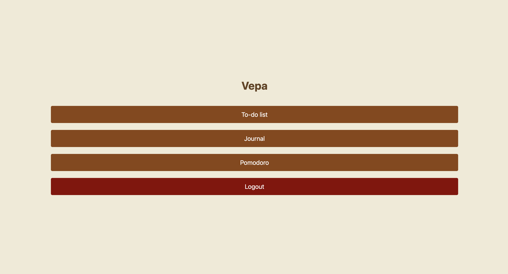
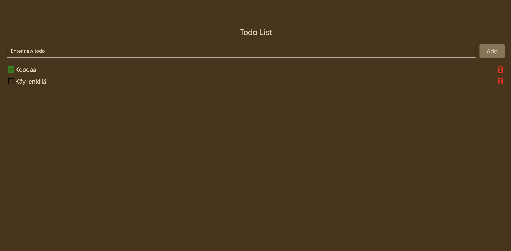
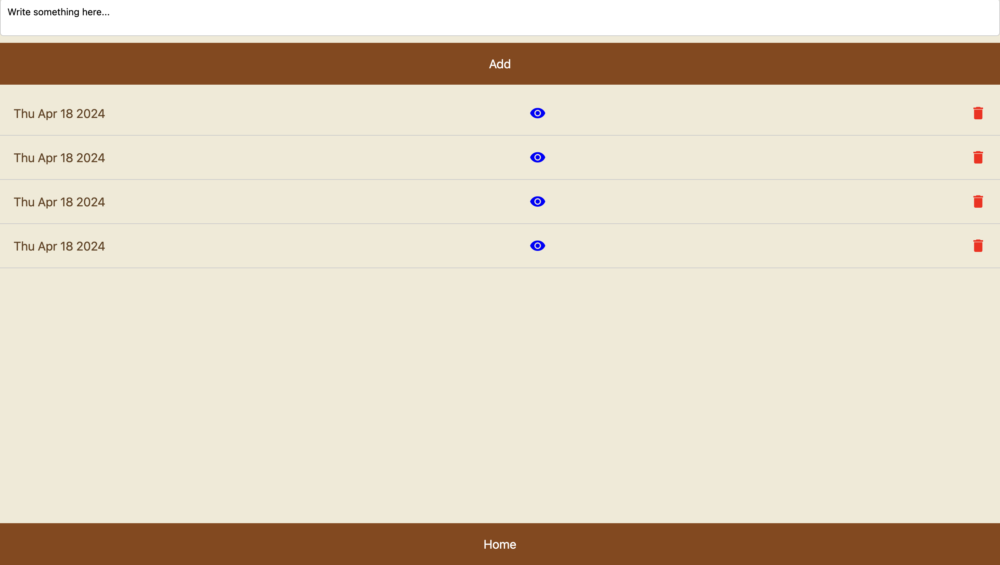
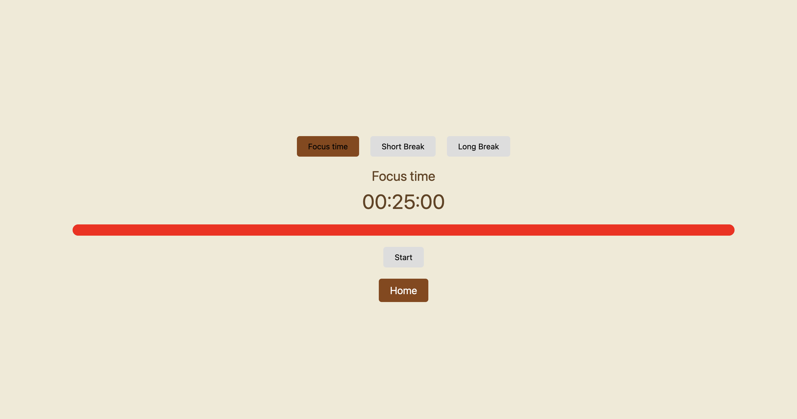

# Vepa



## TODO LISTA



## PÄIVÄKIRJA



## POMODORO -AJASTIN



### Used technologies:

1. Firestore database
2. Firebase Auth
3. Expo
4. React Native
5. TypeScript

## How to use Vepa (!!! you need to have EXPO app in your phone):

### Clone

```
git clone https://github.com/jxmijuholx/Vepa.git
```

### cd into it

```
cd Vepa
```

### Start the server

```
npm start
```

### Scan the QR code

```
Android: open the EXPO app and scan it using the built-in scanner
iOs: Scan the QR with your camera

Scanning the QR code will open up expo SDK and then it will load the app
```

### IMPORTANT!

```
    DO NOT INSERT ANY PERSONAL INFORMATION TO THE APP LIKE YOUR EMAIL, PASSWORD OR DEEPEST DARKEST SECRETS
    THE APP IS JUST A PROTOTYPE AND IT MAY CONTAIN VULNERABILITIES

    so when you create and account...
    !! MAKE UP AN IMAGINERY EMAIL AND PASSWORD !!
```